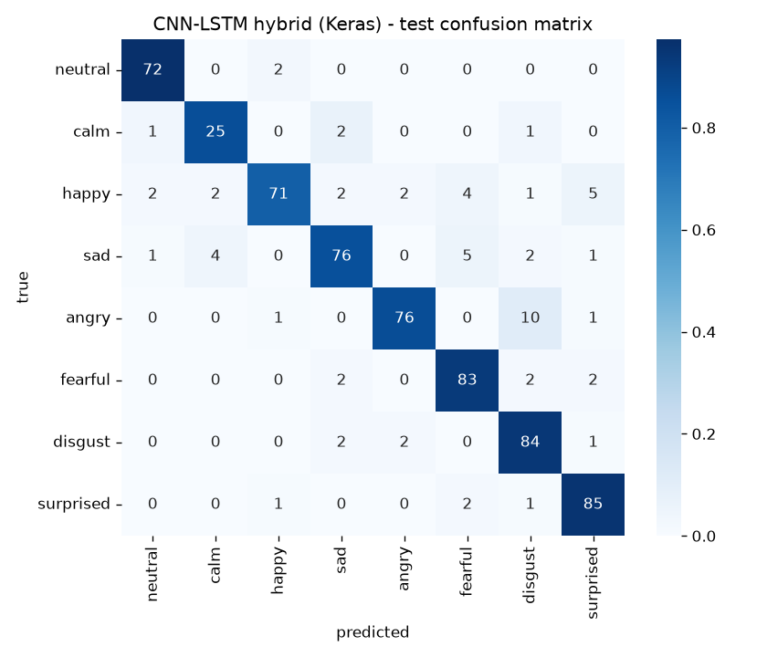

# Speech Emotion Recognition — Hybrid CNN-LSTM

🔗 **[Live demo](https://speech-emotion-recognition-sonali-verma.streamlit.app/)** — record or
upload a speech clip and see it classified in real time.

Emotion classification (neutral, calm, happy, sad, angry, fearful, disgust, surprised) from the
acoustic properties of speech, independent of the words spoken. Built on RAVDESS + TESS (4,240
clips) with an ablation-style evaluation: an SVM baseline is beaten by two single-architecture
models (LSTM-only, CNN-only), which are in turn beaten by a CNN-LSTM hybrid — each step required to
justify its added complexity, not just added for its own sake.

Implemented in TensorFlow/Keras.

## Results

Final test-set metrics, `data/processed/metadata.csv`'s held-out 636-clip test split:

| Model              | Test accuracy | Macro-F1 |
|--------------------|--------------:|---------:|
| SVM (avg. MFCCs)   | 82.4%         | 0.802    |
| LSTM-only          | 87.3%         | 0.867    |
| CNN-only           | 84.4%         | 0.827    |
| **CNN-LSTM hybrid**| **89.9%**     | **0.895**|

<p>
  
</p>

## Architecture

```
mel-spectrogram (128, 79, 1)                          ← channels-LAST (Keras default)
    │
    ▼
Conv2D+BN+ReLU+MaxPool(2,1)  × 3   ← pools frequency only; time axis stays at 79 throughout
    │
    ▼
Permute + Reshape → (79, 1024)     ← per-timestep feature vectors, ready for the LSTM
    │
    ▼                               valid_length (2nd model input) → boolean mask → LSTM's
LSTM (hidden=128, mask=...)  ←──── mask= argument, so padded frames never enter the recurrence
    │
    ▼
FC → 8-class softmax
```

The CNN extracts local spectro-temporal texture at each instant; unlike a standard CNN classifier
(which would also pool away the time axis), this one preserves every time step so the LSTM has an
actual sequence to model. **Masking** stops the LSTM's recurrence at each clip's real length instead
of continuing through trailing silence (RAVDESS clips average ~28% padding after silence-trimming) —
`layers.Masking(mask_value=0.)` handles this directly for the plain LSTM model, but the hybrid needs
an explicit mask built from a second `valid_length` input and passed to the LSTM's `mask=` argument,
since Conv2D/BatchNorm destroy the exact-zero padding `layers.Masking` relies on to auto-detect it.
Built with the Keras **Functional API** (`keras.Model(inputs=..., outputs=...)`), not `Sequential` —
this model's CNN→LSTM reshape can't be expressed as a flat layer stack. See `src/models.py` for the
full implementation.

## Repo structure

```
data/raw/               RAVDESS + TESS audio (gitignored — see Setup)
data/processed/         metadata.csv (tracked) + extracted feature arrays (gitignored, regenerable)
src/
  data/                 parsing, preprocessing, splitting, Keras data-prep helpers
  features/              MFCC/mel-spectrogram extraction, augmentation
  baseline.py            SVM baseline (scikit-learn)
  models.py              LSTM, CNN, CNN-LSTM hybrid (Keras Functional API)
  training.py            shared train/eval loop (early stopping, checkpointing, grad clipping, LR schedule)
  evaluation.py          shared metrics (classification report, confusion matrix)
  inference.py           file → prediction pipeline, used by the demo and app.py
scripts/                 training scripts (one per model) + CLI inference demo
app.py                   Streamlit frontend (live mic + file upload) — see Deployment below
results/                 per-model metrics (JSON) — the source of every number in this README
reports/figures/         training curves and confusion matrices for every model
models/                  trained checkpoints — only cnn_lstm_hybrid.keras is tracked (needed by
                         app.py at deploy time); the other two are gitignored, regenerate via scripts/
```

## Setup

```bash
python3 -m venv .venv
source .venv/bin/activate
pip install -r requirements.txt
```

Download RAVDESS ([Zenodo](https://zenodo.org/records/1188976) or
[Kaggle](https://www.kaggle.com/datasets/uwrfkaggler/ravdess-emotional-speech-audio)) and TESS
([TSpace](https://tspace.library.utoronto.ca/handle/1807/24487) or
[Kaggle](https://www.kaggle.com/datasets/ejlok1/toronto-emotional-speech-set-tess)), extract into
`data/raw/ravdess/` and `data/raw/tess/` respectively.

## Usage — Running the Project and Getting Predictions

Four ways to get a prediction out of this project, depending on what you need:

**1. Live demo (no setup required)**
🔗 **[speech-emotion-recognition-sonali-verma.streamlit.app](https://speech-emotion-recognition-sonali-verma.streamlit.app/)**
— record a few seconds of speech or upload a `.wav` file, then click Classify.

**2. Run the Streamlit app locally**
```bash
streamlit run app.py
```
Same interface as the live demo, at `http://localhost:8501`.

**3. Command line**
```bash
python3 scripts/predict_emotion.py path/to/your_clip.wav
```
Prints the predicted emotion, its confidence, and the full probability breakdown across all 8
classes. Predictions below 50% confidence are reported as `uncertain` rather than a forced guess.

**4. From Python, in your own code**
```python
from src.inference import load_model, predict_emotion

model = load_model("models/cnn_lstm_hybrid.keras")
result = predict_emotion("path/to/your_clip.wav", model, confidence_threshold=0.5)
print(result["label"], result["confidence"], result["probabilities"])
```

## Reproducing training from scratch

```bash
python3 scripts/train_svm_baseline.py
python3 scripts/train_lstm_only.py
python3 scripts/train_cnn_only.py
python3 scripts/train_hybrid.py     # builds the augmented training set first, then trains
```

**Or train on a free GPU instead**: [`notebooks/01_train_on_colab.ipynb`](notebooks/01_train_on_colab.ipynb)
reproduces the whole pipeline (SVM → LSTM-only → CNN-only → hybrid) on Colab (or any GPU notebook
platform) — it's a thin runner over the same `src/`/`scripts/` code above, not a reimplementation,
so results match exactly. Useful mainly because this project's local machine has no GPU support for
TensorFlow; Colab's free T4 trains the hybrid in a couple of minutes instead of ~15-20.

## Deployment

Live at **[speech-emotion-recognition-sonali-verma.streamlit.app](https://speech-emotion-recognition-sonali-verma.streamlit.app/)**,
hosted free on Streamlit Community Cloud, redeploying automatically on every push to `main`.

`app.py` is a Streamlit frontend with two input modes: live microphone recording
(`st.audio_input`, captured in the *viewer's* browser — works wherever the app runs, regardless of
whether the machine serving it has a mic) and `.wav` file upload. Both paths run the exact same
`src/inference.predict_emotion` used by the CLI above.

**To deploy your own copy:**
1. Push this repo to your own GitHub account (`models/cnn_lstm_hybrid.keras` is intentionally
   tracked — see Repo structure above — since Streamlit Cloud has no training step, just this file).
2. Go to [share.streamlit.io](https://share.streamlit.io), sign in with GitHub, and create a new app
   pointing at your fork/repo with `app.py` as the entry point.
3. It installs from `requirements.txt` and redeploys automatically on every push to `main`.

## Notes on this hardware

Trained on CPU — Apple Silicon GPU acceleration (`tensorflow-metal`) isn't available for this
Python/macOS combination yet, so Conv2D-heavy training (CNN-only, hybrid) is slower than it would be
with GPU support (the CNN-only model: ~70s/epoch). Not a design choice, just this machine's current
constraint.
